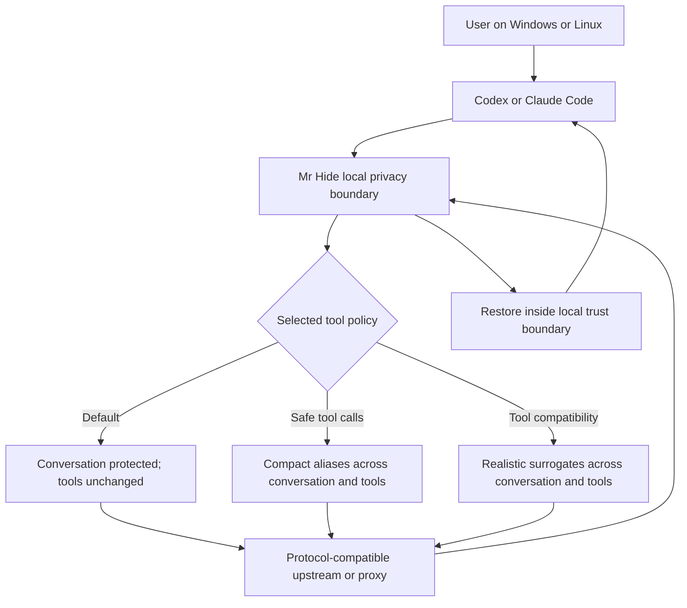

# Token-Aware Presidio Privacy Proxy - Plan

## Goal Capsule

- **Objective:** Deliver a local privacy proxy that lets individuals and companies use Codex and Claude Code without sending detected personal data or secrets unchanged to their inference provider.
- **Product authority:** This document defines the MVP behavior, privacy boundary, tool modes, conversation lifecycle, and product exclusions for Mr Hide.
- **Execution profile:** Greenfield Python CLI and local proxy for Windows and Linux.
- **Open blockers:** None at product-contract level. Implementation choices listed under Deferred to Planning must not change the behavior defined here.

---

## Product Contract

### Summary

Mr Hide will be a local Python CLI and privacy proxy for Codex and Claude Code.
It will detect sensitive text with Presidio, substitute it before inference, restore it inside the user's trust boundary, and remain composable with providers and other proxies.

### Problem Frame

Individuals and companies commonly send coding-agent traffic to external inference providers without first removing personal data or credentials.
Manual sanitization is not part of their normal workflow and would undermine the interactive context that makes coding agents useful.

Existing products prove that reversible PII masking is feasible, but the available shapes either depend on a larger gateway, focus on generic application traffic, or do not combine token-conscious aliases, explicit tool policies, resumable local vaults, and launch-time compatibility with both Codex and Claude Code.
Mr Hide addresses that specific gap without claiming to protect arbitrary source code or all confidential business information.

### Key Decisions

- **Standalone and composable proxy.** Mr Hide is independent of OCGO, Headroom, providers, and model routers. It can sit before another proxy or directly before a compatible provider. (session-settled: user-directed — chosen over building an OCGO- or Headroom-specific companion: a privacy boundary should compose with any upstream without interfering with it.)
- **Protocol preservation instead of translation.** Mr Hide preserves the client's protocol and delegates model routing or protocol conversion to the chosen upstream. (session-settled: user-approved — chosen over becoming a general compatibility gateway: detection, substitution, restoration, and forwarding are the product's single responsibility.)
- **Token-aware reversible aliases.** Conversational substitutions use the smallest reliable aliases selected through tokenizer measurements rather than verbose placeholders. (session-settled: user-approved — chosen over descriptive placeholders alone: privacy transformations should minimize token overhead and may reduce repeated long identifiers.)
- **Tools remain untouched by default.** Tool definitions, arguments, results, and tool history bypass transformation unless the user selects another tool mode. (session-settled: user-directed — chosen over privacy-first transformation as the default: existing tools should keep working without unexpected mutations.)
- **Safe tool mode is best effort.** `--safe-tool-calls` applies compact aliases to model-visible tool traffic and blocks known transformation failures without silently falling back to raw data. (session-settled: user-directed — chosen over compatibility fallbacks and policy enforcement: the user accepts that transformed tools may break.)
- **Compatibility mode uses realistic PII surrogates.** `--tool-compatibility` uses type-valid, reversible mock values for PII, non-working stand-ins for secrets, and restores real values only inside the user's local execution boundary. (session-settled: user-directed — chosen over opaque aliases inside tools: realistic non-sensitive shapes give tools and models a better chance of preserving behavior without minting usable credentials.)
- **Stable sequential mappings.** The same original entity receives the same substitute within a conversation; a different entity of the same type receives the next unused bank value. (session-settled: user-directed — chosen over random replacement per occurrence: referential identity must survive repeated mentions and tool round trips.)
- **All three tool policies ship in the MVP.** Default, `--safe-tool-calls`, and `--tool-compatibility` are initial product behavior rather than later extensions. (session-settled: user-directed — chosen over deferring advanced tool compatibility: agentic workflows are part of the first useful release.)
- **Known failures stop before disclosure.** Detection, substitution, restoration, or vault failures stop the affected operation and report the error before any raw fallback occurs. (session-settled: user-directed — chosen over fail-open forwarding: a privacy component must not silently disclose data when it knows protection failed.)
- **Bypass is explicit and conversation-scoped.** After a blocking privacy error, the user may accept a clear warning and bypass protection for that entire conversation; bypass is never automatic or global. (session-settled: user-directed — chosen over permanent failure or per-request approval: the user retains control without changing other conversations.)
- **Conversations are resumable and persistent.** A resumed Codex or Claude Code conversation reuses its encrypted mapping vault and bypass state for up to 30 days after its last activity. (session-settled: user-directed — chosen over memory-only mappings: native resume workflows must preserve referential identity across process and machine restarts.)
- **Local single-process Python product.** The supported runtime is Python 3.11 or later, with Presidio integrated into the proxy process. (session-settled: user-directed — chosen over a Go launcher with a Python sidecar or a LiteLLM/PrivAiTe extension: one Python process minimizes custom code and operational parts.)
- **Best-effort detection claim.** Mr Hide guarantees handling of entities it detects, not detection of every sensitive value. (session-settled: user-approved — chosen over a zero-leakage claim: Presidio explicitly cannot guarantee complete automated detection.)
- **PII and secrets, not arbitrary intellectual property.** The privacy boundary covers supported personal-data entities and detectable technical secrets, but not complete source-code confidentiality or all proprietary information. (session-settled: user-approved — chosen over treating all code as sensitive content: concealing the codebase would prevent a coding model from working on it.)

### Actors

- A1. The user launches, resumes, observes, and can explicitly bypass one protected conversation.
- A2. Codex or Claude Code sends model requests and receives restored responses through its normal CLI experience.
- A3. Mr Hide owns local detection, substitution, mapping, restoration, privacy errors, and conversation state.
- A4. A local tool runtime executes tool calls according to the selected tool policy.
- A5. The upstream is either a protocol-compatible inference provider or another proxy such as OCGO or Headroom.

### Requirements

**Product boundary and compatibility**

- R1. Mr Hide must run on the user's Windows or Linux computer and bind its privacy boundary locally by default.
- R2. The MVP must support end-to-end Codex traffic using the OpenAI Responses protocol and Claude Code traffic using the Anthropic Messages protocol.
- R3. The supported client flows must include the text, Server-Sent Events streaming, token-count interaction, tool definitions, tool calls, and tool results needed by Codex and Claude Code.
- R4. Launching either client through Mr Hide must use isolated process configuration and must not permanently overwrite the user's existing Codex or Claude Code configuration.
- R5. The CLI must provide launch and resume workflows that pass supported client arguments through without requiring manual proxy configuration.
- R6. The user must be able to select an arbitrary protocol-compatible upstream URL, including another local proxy.
- R7. Except for privacy transformations in recognized content, forwarding must preserve HTTP methods, route and query information, relevant headers, status behavior, streaming order, and unknown structured fields.
- R8. Mr Hide must not route models, translate between provider protocols, manage provider subscriptions, or perform general prompt compression.

**Detection and substitution**

- R9. Presidio detection must operate locally across all model-visible conversational text and support English, Spanish, and mixed-language content in the MVP.
- R10. The protected entity baseline must include Presidio-supported personal, contact, location, government-identifier, financial, and health-data entities available for the supported languages.
- R11. When they occur in model-visible content, the protected secret baseline must include recognizable API keys, access tokens, passwords, JWTs, authentication headers, private keys, and credential-bearing database connection strings; transport credentials required to authenticate with the configured upstream remain transport metadata.
- R12. Users must be able to configure additional local recognizers for organization-specific identifiers without sending recognizer data to an external service.
- R13. Conversational aliases must be reversible, collision-free within their conversation, and selected from measured compact candidates for the tokenizers relevant to the supported clients.
- R14. Token awareness must be described honestly: substitutions minimize overhead and can save tokens for long or repeated values, but may add tokens when the original value is already short.
- R15. Every occurrence of a normalized original entity within a conversation must resolve to its established substitute, including occurrences across later requests and restored upstream responses.
- R16. Detected secrets must never be represented by a surrogate that could be mistaken for a valid working credential.
- R17. The product must state that automated detection is best effort and cannot guarantee that every sensitive value will be found.

**Tool policies**

- R18. The default mode must leave tool definitions, arguments, results, and tool history unmodified while still protecting ordinary conversational content.
- R19. The default-mode documentation and runtime status must warn that sensitive values carried through tools can reach the inference provider unchanged.
- R20. `--safe-tool-calls` must apply the same compact alias system to model-visible tool traffic and must not fall back to raw tool data after a known privacy-processing failure.
- R21. `--safe-tool-calls` must be presented as best effort and may break tools whose identifiers, paths, commands, schemas, or values cannot tolerate substitution.
- R22. `--tool-compatibility` must replace PII with realistic, type-valid, non-sensitive surrogates and secrets with non-working stand-ins across conversation and model-visible tool traffic.
- R23. In compatibility mode, the same original must map to the same surrogate and each distinct original of the same entity type must consume the next unused value from its bank.
- R24. Compatibility banks must avoid collisions, never reuse a value within a conversation, and extend deterministically when their predefined values are exhausted.
- R25. Before a tool executes locally in compatibility mode, Mr Hide must restore mapped real values; tool results must be remapped before becoming model-visible; user-visible final text must be restored.

**Conversation vault and bypass**

- R26. Each protected client launch must create a distinct conversation identity unless the user explicitly resumes an existing one.
- R27. A native Codex or Claude Code resume workflow must reconnect the new client process to the correct Mr Hide conversation and mapping vault.
- R28. Conversation mappings and bypass state must survive Mr Hide and computer restarts in an encrypted local vault.
- R29. The vault must expire and be deleted 30 days after the conversation's last activity; resumed activity before expiry must refresh that retention window.
- R30. Vault contents, encryption material, and privacy state must be separated so copying the data store alone does not reveal original values.
- R31. If privacy processing cannot complete, Mr Hide must stop the affected request, explain the failure, and avoid sending raw or partially transformed content upstream.
- R32. The failure interaction may offer bypass only after explaining that the conversation's data will be sent without Mr Hide protection.
- R33. An accepted bypass must apply only to that conversation, persist across its resumes, remain visibly indicated, and leave all other conversations protected.
- R34. Expired conversation state must not be silently reconstructed; a later client session starts with a new vault and mappings.

**Local operation and delivery**

- R35. Python 3.11 or later may be required, but users must not need to install Docker or operate Presidio as a separate service.
- R36. Installing the Python package must provide the Mr Hide CLI and its declared dependencies through standard Python package tooling.
- R37. Runtime logs and telemetry must exclude original sensitive values, mapping contents, credentials, and unredacted request or response bodies.
- R38. The project must provide automated Windows and Linux coverage for the privacy boundary and both supported client contracts before an MVP release is considered usable.

### Privacy and Data Flow

The diagram shows policy differences at the model boundary.
The requirements remain authoritative for the exact behavior of each mode.

### Key Flows

- F1. Protected inference round trip
  - **Trigger:** The user launches or resumes Codex or Claude Code through Mr Hide without conversation bypass.
  - **Actors:** A1, A2, A3, A5.
  - **Steps:** Mr Hide identifies the conversation, detects protected entities in eligible content, substitutes them according to the active policy, forwards the preserved protocol to the upstream, and restores mapped values in the response.
  - **Outcome:** The client receives a usable response while every entity Mr Hide detected remained substituted outside the local trust boundary.
  - **Covers:** R1-R17, R26-R30.
- F2. Known privacy failure and bypass
  - **Trigger:** Detection, substitution, vault access, or restoration cannot complete safely.
  - **Actors:** A1, A2, A3.
  - **Steps:** Mr Hide blocks the operation, reports the privacy failure, warns what bypass means, and waits for explicit user authorization before retrying the conversation without protection.
  - **Outcome:** No automatic fail-open occurs; an accepted bypass is isolated to and visibly follows that conversation.
  - **Covers:** R31-R34.
- F3. Default tool execution
  - **Trigger:** The model emits or consumes tool traffic while no tool-specific flag is active.
  - **Actors:** A2, A3, A4, A5.
  - **Steps:** Mr Hide protects eligible conversational content but passes tool definitions, calls, arguments, results, and history without substitution.
  - **Outcome:** Existing tool behavior is preserved and the user remains informed that tool-carried data is outside the default privacy boundary.
  - **Covers:** R18-R19.
- F4. Safe tool execution
  - **Trigger:** The client runs with `--safe-tool-calls`.
  - **Actors:** A1, A2, A3, A4, A5.
  - **Steps:** Mr Hide applies compact mappings to model-visible conversation and tool traffic, restores only mapped values at the local boundary, and stops when a known transformation cannot complete.
  - **Outcome:** Tool privacy is stronger than default mode, with an accepted risk that some tools no longer function.
  - **Covers:** R20-R21, R31-R33.
- F5. Compatibility-oriented tool execution
  - **Trigger:** The client runs with `--tool-compatibility`.
  - **Actors:** A1, A2, A3, A4, A5.
  - **Steps:** Mr Hide assigns stable realistic PII surrogates and non-working secret stand-ins, restores originals before local execution, and replaces sensitive tool results with the established substitutes before returning them to the model.
  - **Outcome:** The provider sees coherent non-sensitive data while local tools operate on the real mapped values.
  - **Covers:** R22-R25.
- F6. Conversation resume and expiry
  - **Trigger:** The user resumes a supported client conversation or its inactivity reaches 30 days.
  - **Actors:** A1, A2, A3.
  - **Steps:** A valid resume reconnects to the encrypted vault and refreshes its retention; expiry deletes the vault and prevents later implicit recovery.
  - **Outcome:** Referential mappings and bypass state survive legitimate resumes but do not persist indefinitely.
  - **Covers:** R26-R34.

### Acceptance Examples

- AE1. Compact alias round trip
  - **Covers:** R13-R15.
  - **Given:** A protected conversation contains the same long personal name several times.
  - **When:** Mr Hide sends the conversation upstream and restores the response.
  - **Then:** Every model-visible occurrence uses one stable measured alias, the user sees the original name, and the token report does not claim savings unless measurement supports them.
- AE2. Default tool compatibility
  - **Covers:** R18-R19.
  - **Given:** A tool argument contains a path or identifier that Presidio would otherwise classify.
  - **When:** Neither tool flag is active.
  - **Then:** The argument remains byte-for-byte unchanged and the active-mode status makes the privacy limitation visible.
- AE3. Safe tool failure
  - **Covers:** R20-R21, R31-R33.
  - **Given:** Compact substitution makes a tool call invalid or privacy processing reports an error.
  - **When:** `--safe-tool-calls` is active.
  - **Then:** Mr Hide does not silently resend the raw call; it reports the failure and offers only the conversation-scoped bypass flow.
- AE4. Sequential compatibility surrogates
  - **Covers:** R22-R25.
  - **Given:** A conversation contains `Juan Antonio Perez` repeatedly and later introduces `Maria Rodriguez`.
  - **When:** `--tool-compatibility` is active across messages and tool calls.
  - **Then:** The first person consistently receives the first unused person surrogate, the second receives the next, local tools receive the originals, and the user sees the originals in final text.
- AE5. Proxy composition
  - **Covers:** R2-R8.
  - **Given:** OCGO or another compatible proxy is configured as the upstream.
  - **When:** Codex or Claude Code sends supported streaming and tool traffic through Mr Hide.
  - **Then:** Mr Hide performs only privacy transformations and the upstream remains responsible for its own routing or protocol behavior.
- AE6. Fail-closed with explicit bypass
  - **Covers:** R31-R33.
  - **Given:** Presidio or the reversible vault becomes unavailable before forwarding.
  - **When:** The user has not accepted bypass for that conversation.
  - **Then:** No request is sent upstream; after an informed acceptance, only that conversation continues in visibly unprotected mode.
- AE7. Resume within and after retention
  - **Covers:** R26-R34.
  - **Given:** A protected conversation is closed and later resumed.
  - **When:** It is resumed before 30 days of inactivity and again after the retention window has expired.
  - **Then:** The first resume reuses its mappings and bypass state; the expired conversation cannot recover its deleted vault and starts a new privacy context.
- AE8. Configuration preservation
  - **Covers:** R4-R5.
  - **Given:** The user already has working Codex and Claude Code configuration.
  - **When:** The user launches and exits either client through Mr Hide.
  - **Then:** The original configuration remains unchanged and launching the client normally continues to use its previous setup.

### Success Criteria

- Every entity detected in the supported request fields is absent in original form from captured upstream test traffic unless that conversation is visibly in bypass.
- Every mapped value in supported non-bypass responses and compatibility-mode tool boundaries restores exactly to its conversation-specific original.
- Codex and Claude Code complete representative text, SSE streaming, tool-call, tool-result, error, and resume scenarios on both Windows and Linux.
- Default tool mode shows no tool-payload mutation; both opt-in modes satisfy their documented privacy and failure behavior.
- Alias benchmarks record token counts for supported-client tokenizers and select compact defaults without claiming universal savings.
- Installation and launch require Python but no separate Presidio service, Docker deployment, or permanent client reconfiguration.
- Logs and diagnostics from all acceptance scenarios contain no original protected values or vault contents.

### Scope Boundaries

**MVP**

- A local, single-user Python CLI and proxy on Windows and Linux.
- Codex through OpenAI Responses and Claude Code through Anthropic Messages, including required text, SSE, counting, and tool workflows.
- English and Spanish Presidio analysis, the defined PII and technical-secret baseline, custom local recognizers, and reversible token-aware substitutions.
- Default, `--safe-tool-calls`, and `--tool-compatibility` policies.
- Encrypted resumable conversation vaults, 30-day sliding retention, fail-closed errors, and explicit conversation-scoped bypass.
- Configurable protocol-compatible upstreams and isolated client launch configuration.

**Deferred for later**

- macOS support.
- Shared team gateways, centralized administration, organization policy distribution, and enterprise key management.
- Image OCR, audio, video, opaque binary attachments, and other multimodal detection.
- WebSocket transport, additional provider protocols, clients beyond Codex and Claude Code, and broader API parity.
- A graphical dashboard, remote telemetry, audit exports, and centrally managed surrogate banks.
- Detection engines beyond Presidio and specialized high-assurance recognizer packs.

**Outside this product's identity**

- Model routing, provider subscription management, protocol translation, fallback chains, and inference optimization.
- General prompt or context compression unrelated to privacy aliases.
- Tool approval, allowlists, sandboxing, command authorization, or guaranteed tool correctness.
- Guaranteed detection of all sensitive information, complete DLP, or protection of arbitrary source code and intellectual property.

### Dependencies and Assumptions

- Python 3.11 or later is available on the user's Windows or Linux computer.
- Codex and Claude Code continue to expose launch-time configuration for a custom local base URL and preserve a usable conversation-resume identity.
- The selected upstream accepts the protocol Mr Hide receives; another proxy performs any required translation.
- Presidio and its English and Spanish language resources can run locally without sending detection input elsewhere.
- Automated detection produces false negatives and false positives; the product reduces exposure risk but does not replace organizational data-governance controls.
- Conversation-vault encryption can use a local key-protection mechanism that keeps usable key material separate from encrypted mappings on both supported operating systems.

### Outstanding Questions

**Resolve Before Planning**

- None.

**Deferred to Planning**

- Select the Python packaging and language-model installation flow that satisfies R35-R36 on Windows and Linux.
- Select the local encrypted-vault and key-protection backends that satisfy R28-R30 without changing resume or retention behavior.
- Verify the stable conversation identifiers and resume hooks exposed by supported Codex and Claude Code versions.
- Define the supported structured-field matrix for each client contract and the fixtures needed to prove preservation of unknown fields.
- Define tokenizer benchmark inputs and the versioning format for compact aliases and compatibility banks.
- Establish Git initialization, cross-platform CI commands, release versioning, and the first Python distribution channel.

### Sources and Research

- `docs/orchestration/2026-07-22-001-token-aware-privacy-proxy-readiness-report.md` records the original readiness gaps and validated conversation context.
- [OCGO](https://github.com/ElZaWarudo/ocgo) demonstrates isolated Codex configuration, launch-time Claude configuration, local Anthropic/OpenAI-compatible surfaces, SSE, and basic tool translation without requiring permanent changes to the clients.
- [Microsoft Presidio](https://data-privacy-stack.github.io/presidio/) documents local analyzer/anonymizer capabilities and warns that automated detection cannot guarantee discovery of all sensitive information.
- [Presidio anonymizer](https://data-privacy-stack.github.io/presidio/anonymizer/) documents replace, custom, encrypt, and deanonymize operators while leaving cross-request state management to the integrating product.
- [Presidio with LiteLLM](https://microsoft.github.io/presidio/samples/docker/litellm/) demonstrates reversible PII masking around multi-provider LLM traffic.
- [PrivAiTe](https://pypi.org/project/privaite/) is a close self-hosted comparison covering reversible PII replacement and agentic tool arguments.
- [OWASP LLM02](https://genai.owasp.org/llmrisk/llm022025-sensitive-information-disclosure/) distinguishes PII, credentials, confidential business data, and proprietary source code as related but broader sensitive-information categories.
- [GitHub secret scanning patterns](https://docs.github.com/en/code-security/reference/secret-security/supported-secret-scanning-patterns) grounds the MVP categories for common code-hosted credentials.
