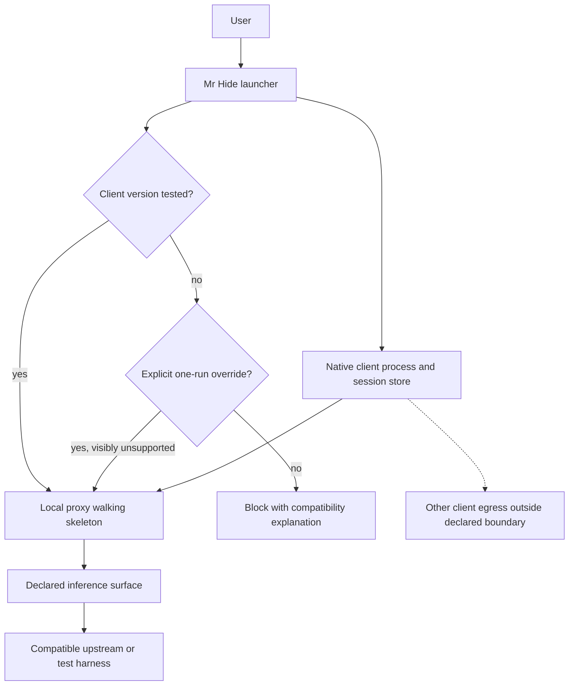
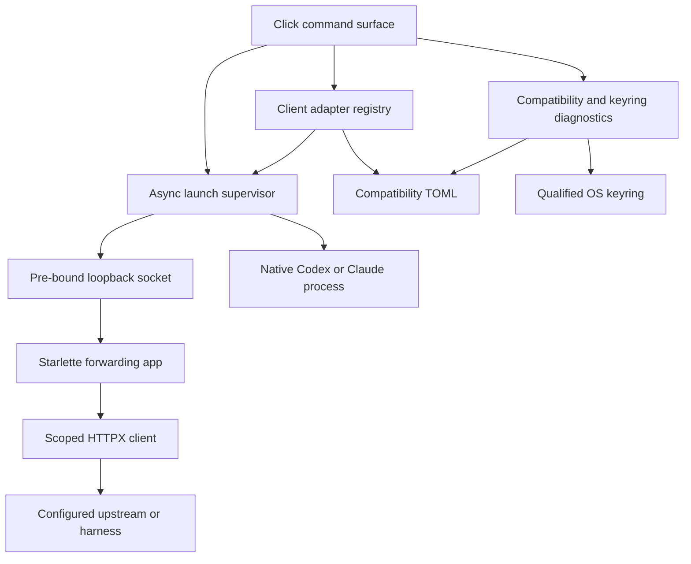
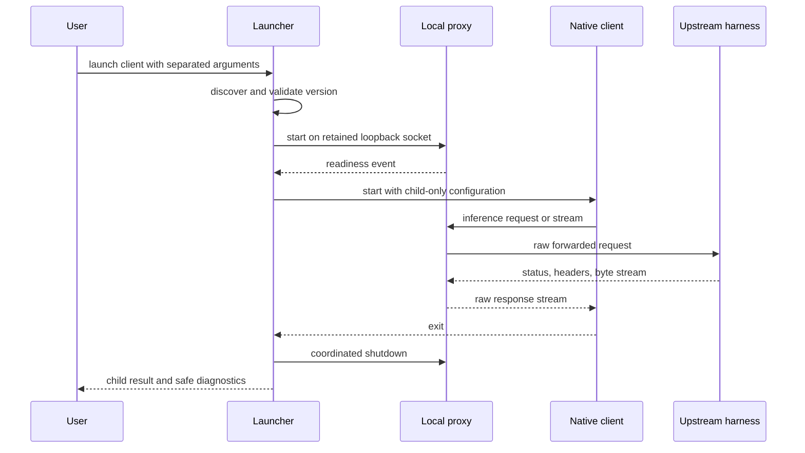
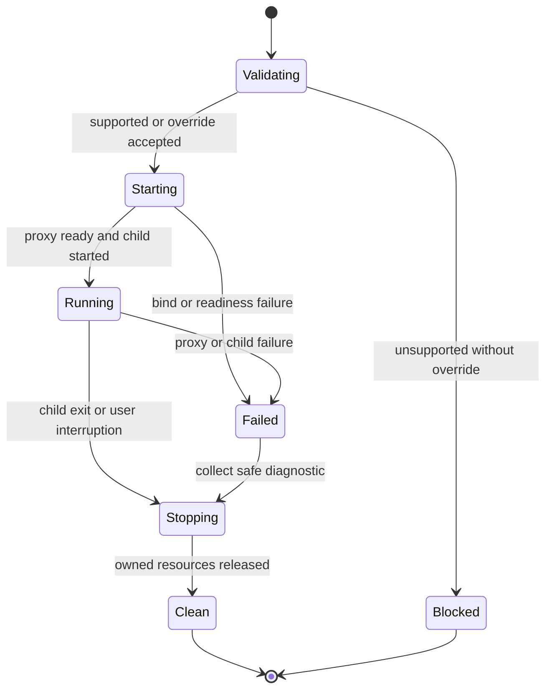

# Executable Privacy Proxy Foundation - Plan

## Goal Capsule

- **Objective:** Establish a runnable Python foundation that proves Mr Hide can launch, proxy, and resume supported Codex and Claude Code versions without modifying their persistent configuration or claiming privacy behavior that has not been implemented.
- **Product authority:** This document defines RDM-001 only: client compatibility evidence, local process behavior, configuration and credential isolation, traffic-boundary visibility, cross-platform project scaffolding, and verification foundations.
- **Authority order:** `docs/initiative-brief.md` → this Product Contract → Planning Contract and Implementation Units → repository instructions.
- **Execution profile:** Deep, security-sensitive greenfield Python work; start with executable contract tests and keep every fixture synthetic.
- **Stop conditions:** Stop rather than guessing if client configuration cannot preserve native auth/session state, a supported client requires non-inference traffic to traverse Mr Hide, or secure key separation cannot be proven on either supported OS.
- **Tail ownership:** Compound Master owns implementation/review readiness; Release Marshal alone owns commits, Jira, PRs, and merges.
- **Open blockers:** None.

---

## Product Contract

### Summary

RDM-001 uses a single-process async Python launcher, explicit client adapters, and a loopback byte-streaming proxy to create an executable walking skeleton for Mr Hide.
Pinned real-client contracts, OS-backed keyring probes, and Windows/Linux CI define the compatibility envelope before privacy transformations or durable vault behavior are built on top.

### Problem Frame

Mr Hide is a privacy boundary around clients whose configuration, authentication, session storage, wire behavior, and release cadence it does not control.
The repository currently contains no executable application, compatibility fixtures, test commands, or CI.
Building detection and reversible state first would make them depend on unverified client hooks and could hide unsupported behavior behind a privacy claim.

### Key Decisions

- **One executable foundation, not a research-only spike.** Compatibility evidence and the runnable scaffold ship as one independently verifiable capability because later work depends on both.
- **Inference traffic is a bounded surface.** The foundation inventories inference, authentication, model discovery, telemetry, update, and other client traffic without implying that changing an inference base URL protects every network request.
- **Client state remains native.** Mr Hide uses execution-scoped configuration and must not permanently rewrite or replace the user's normal client configuration, credentials, or session store.
- **Tested client-version envelope.** Mr Hide supports explicitly tested Codex and Claude Code version ranges; an untested version blocks unless the user accepts a visibly unsupported override for that execution. (session-settled: user-approved — chosen over silently accepting every client update: a privacy boundary must not imply compatibility for behavior it has not verified.)
- **Default tools are outbound-transparent and locally restorative.** Provider-bound tool traffic is not protected by default, while an already-known conversational alias is restored before local tool execution without discovering or transforming other tool values. (session-settled: user-approved — chosen over literal byte-for-byte passthrough in both directions: local tools need the real value behind a known alias without turning the default into a protected tool mode.)
- **No privacy-complete claim.** A passthrough walking skeleton may observe sanitized fixtures for verification, but RDM-001 does not claim Presidio detection, substitution, restoration, encrypted mapping storage, or protected production traffic.

<!-- ce-section: work-relationships -->
### How This Work Fits Together

This plan owns RDM-001, the executable and evidentiary foundation for the larger privacy proxy initiative.

- RDM-002 depends on this work and adds the reversible privacy engine, tool-policy behavior, and durable conversation vault.
  - RDM-003 depends on RDM-002 and applies the shared boundary to Codex over OpenAI Responses.
  - RDM-004 depends on RDM-002 and applies the shared boundary to Claude Code over Anthropic Messages.
- RDM-005 depends on both client capabilities and produces the cross-platform MVP release evidence and packaging hardening.

### Actors

- A1. The user launches or resumes a client through Mr Hide and decides whether to override an unsupported-version block.
- A2. The Mr Hide launcher validates compatibility, starts and observes the local proxy, configures the child process, and reports lifecycle failures.
- A3. Codex or Claude Code retains ownership of its native configuration, credentials, session identity, and tool runtime.
- A4. The local proxy walking skeleton forwards only its declared inference surface and exposes no privacy-complete claim.
- A5. A protocol-compatible upstream or controlled compatibility harness receives the forwarded request and returns the response.
- A6. Cross-platform automation verifies the supported matrix without using sensitive production payloads.

### Requirements

**Executable project and local boundary**

- R1. The repository must provide an installable Python 3.11+ project that exposes the Mr Hide CLI on Windows and Linux without requiring Docker or a separate Presidio service.
- R2. The CLI must start a local-only proxy walking skeleton, wait until it is ready, launch the selected client, and terminate or report failures without leaving an unintended background process.
- R3. Concurrent launches must receive distinct execution and process context so that ports, lifecycle events, and execution-scoped settings do not collide.
- R4. The RDM-001 walking skeleton must bind only to loopback and fail safely when its local endpoint cannot be established, while preserving support for user-selected local or remote upstream URLs.

**Client configuration and lifecycle**

- R5. The launcher must support a minimal real inference round trip for Codex through its Responses-compatible configuration surface and Claude Code through its Messages-compatible configuration surface.
- R6. Launching through Mr Hide must use execution-scoped configuration and leave the user's persistent client configuration unchanged after normal exit, client failure, proxy failure, and user interruption.
- R7. The launch path must preserve the client's usable authentication and session state while preventing credentials from appearing in Mr Hide logs, diagnostics, command echoes, or generated artifacts.
- R8. A supported native resume command must preserve and expose the client's stable resume identity for the future RDM-002 conversation binding without copying, replacing, or independently owning the client's transcript store.
- R9. Supported client arguments unrelated to Mr Hide must pass through, while conflicts with Mr Hide-owned launch settings must produce a clear error rather than ambiguous precedence.

**Compatibility and traffic contracts**

- R10. Mr Hide must publish machine-readable and human-readable tested version ranges for Codex and Claude Code derived from passing compatibility evidence.
- R11. A client version outside the tested range must block by default and may proceed only after a visibly unsupported override limited to that execution.
- R12. Compatibility verification must distinguish inference traffic from authentication, model discovery, telemetry, update, and other client egress, and user-facing documentation must state which surfaces Mr Hide does and does not mediate.
- R13. The walking skeleton must preserve the minimal HTTP and streaming behavior needed to prove each client's configuration and resume hooks, without claiming complete protocol coverage.
- R14. The foundation must define sanitized fixture boundaries for text, streaming, errors, counting, and tool traffic so later protocol work can expand them without recording secrets or personal data.

**Security and delivery foundation**

- R15. Diagnostics must exclude credentials, unredacted bodies, future mapping contents, and sensitive environment values in success and failure paths.
- R16. The foundation must prove that Windows and Linux can keep future vault encryption material separate from encrypted mapping data, without implementing the RDM-002 vault lifecycle.
- R17. Automated checks must run the natural project test, lint, type, packaging, and compatibility-fixture entry points on Windows and Linux through stable contributor commands.
- R18. Compatibility evidence must record client and platform versions, exercised surfaces, result, and limitations without treating an override run as supported evidence.

### Boundary Flow



### Key Flows

- F1. Supported launch foundation
  - **Trigger:** A1 launches a client version inside the tested range through Mr Hide.
  - **Actors:** A1, A2, A3, A4, A5.
  - **Steps:** A2 validates the version and settings, starts A4 on the local boundary, waits for readiness, launches A3 with execution-scoped configuration, and observes a minimal inference round trip.
  - **Outcome:** The round trip succeeds without changing persistent client state or claiming that payload privacy is implemented.
  - **Covers:** R1-R7, R9-R15.
- F2. Unsupported-version decision
  - **Trigger:** A2 detects a client version outside the published tested range.
  - **Actors:** A1, A2.
  - **Steps:** A2 blocks launch, reports detected and supported versions, and proceeds only when A1 accepts an execution-scoped unsupported override.
  - **Outcome:** The run remains visibly unsupported and cannot update the published compatibility range.
  - **Covers:** R10-R11, R18.
- F3. Native resume identity propagation
  - **Trigger:** A1 resumes a supported native client session through Mr Hide.
  - **Actors:** A1, A2, A3, A4.
  - **Steps:** A2 preserves A3's session store, captures the stable native resume identity for the future RDM-002 binding, starts the local boundary, and passes through the resume request.
  - **Outcome:** The correct native session resumes and its identity reaches the defined integration seam without creating a durable Mr Hide vault or replacing the client's transcript authority.
  - **Covers:** R6-R9.
- F4. Failure and cleanup
  - **Trigger:** Startup, readiness, proxy forwarding, client execution, or user interruption fails.
  - **Actors:** A1, A2, A3, A4.
  - **Steps:** A2 reports the failing boundary without sensitive data, terminates processes it owns, preserves native client state, and leaves unrelated launches intact.
  - **Outcome:** The user receives an actionable error and no unintended proxy process or persistent configuration mutation remains.
  - **Covers:** R2-R4, R6-R7, R15.

### Acceptance Examples

- AE1. Supported Codex launch
  - **Covers:** R2, R5-R7, R10, R13.
  - **Given:** A tested Codex version and a controlled Responses-compatible upstream are available.
  - **When:** The user launches Codex through Mr Hide and completes the minimal round trip.
  - **Then:** The client uses the local boundary for the declared inference surface, keeps its native state, and exits without a persistent configuration change.
- AE2. Supported Claude Code resume
  - **Covers:** R5-R8, R10, R13.
  - **Given:** A tested Claude Code version has an existing resumable session and a controlled Messages-compatible upstream.
  - **When:** The user resumes that session through Mr Hide.
  - **Then:** The intended native session resumes through the local boundary, its stable identity reaches the future conversation-binding seam, and no transcript copy, durable Mr Hide vault, or persistent configuration change is created.
- AE3. Untested client override
  - **Covers:** R10-R11, R18.
  - **Given:** The installed client version is outside the tested range.
  - **When:** The user accepts the compatibility warning for this launch.
  - **Then:** Only that execution proceeds, remains visibly unsupported, and produces no evidence that expands the supported range.
- AE4. Configuration conflict
  - **Covers:** R6, R9.
  - **Given:** A pass-through client argument conflicts with a setting Mr Hide must own for the local boundary.
  - **When:** The user launches the client.
  - **Then:** Mr Hide rejects the ambiguous launch with a safe explanation and leaves persistent client configuration unchanged.
- AE5. Interrupted concurrent launches
  - **Covers:** R2-R4, R15.
  - **Given:** Two Mr Hide launches are active with distinct contexts.
  - **When:** One client is interrupted while the other continues.
  - **Then:** Only the interrupted launch's owned process is cleaned up, the other remains usable, and diagnostics expose no credentials or bodies.
- AE6. Egress-boundary report
  - **Covers:** R12-R14.
  - **Given:** A compatibility run causes inference and non-inference client traffic.
  - **When:** The evidence is recorded.
  - **Then:** The report distinguishes mediated inference traffic from observed or documented external surfaces and makes no claim that the latter are protected.
- AE7. Future key separation proof
  - **Covers:** R16-R17.
  - **Given:** The foundation checks its secure-storage capability on supported Windows and Linux environments.
  - **When:** The cross-platform verification runs.
  - **Then:** Each platform proves a viable separation boundary for future vault key material without creating a production mapping vault.

### Success Criteria

- A clean checkout can install the project and run the same documented quality entry points on supported Windows and Linux CI environments.
- Tested Codex and Claude Code versions complete their minimal launch and resume fixtures without persistent client configuration changes.
- Unsupported versions cannot start silently, and override runs remain excluded from supported compatibility evidence.
- Failure and interruption fixtures leave no owned process behind and reveal no credential, sensitive body, or client transcript content.
- Compatibility evidence names the mediated inference surface and the limits of all other observed or documented client egress.

### Scope Boundaries

**Included**

- Python package and CLI scaffold, local proxy walking skeleton, child-process lifecycle, and contributor commands.
- Minimal real Codex and Claude Code launch, inference, and resume compatibility evidence.
- Tested-version policy, traffic-boundary inventory, sanitized fixture contract, and Windows/Linux CI foundation.
- Proof that future encryption keys can remain separate from future encrypted mapping data.

**Deferred to later roadmap items**

- Presidio detection, secret recognizers, normalization, aliases, compatibility surrogates, restoration, and all three complete tool-policy implementations.
- Durable encrypted conversation vaults, retention, expiry, bypass persistence, and production key lifecycle.
- Complete OpenAI Responses and Anthropic Messages field, streaming, counting, tool, and error matrices.
- Release packaging hardening, end-user installation claims, compatibility benchmarks, and MVP release documentation.

**Outside this work**

- Protecting authentication, telemetry, update, or arbitrary client network traffic merely because inference uses Mr Hide.
- Model routing, protocol translation, provider subscription handling, prompt compression, or support for additional clients and protocols.
- Using sensitive production payloads as compatibility fixtures or claiming that the walking skeleton is a privacy-complete proxy.

### Dependencies and Assumptions

- Supported Codex versions continue to expose execution-scoped provider configuration and a native resumable session identity.
- Supported Claude Code versions continue to expose an execution-scoped Anthropic-compatible base URL and native resume identifiers.
- The chosen clients and controlled upstreams can be exercised in automated compatibility fixtures without storing real user credentials or transcripts.
- Windows and Linux provide a viable local secure-storage boundary for future key material; RDM-001 proves availability while RDM-002 owns the vault design and lifecycle.
- Exact compatibility ranges are evidence outputs, not permanently fixed product promises.

### Sources and Research

- `docs/initiative-brief.md` is the product authority for the MVP boundary, client behaviors, privacy posture, and accepted tool/version decisions.
- `docs/roadmaps/2026-07-22-001-token-aware-privacy-proxy-roadmap.md` defines RDM-001 and its dependency role.
- The current [Codex configuration manual](https://learn.chatgpt.com/docs/config-file/config-basic) documents `openai_base_url`, one-run configuration overrides, and native state under `CODEX_HOME`; the [Codex CLI reference](https://learn.chatgpt.com/docs/developer-commands?surface=cli) documents `codex resume`.
- Anthropic's [gateway configuration](https://docs.anthropic.com/en/docs/claude-code/llm-gateway) documents `ANTHROPIC_BASE_URL`; its [CLI reference](https://docs.anthropic.com/en/docs/claude-code/cli-usage) documents `--resume` and `--continue`.
- [HTTPX async streaming](https://www.python-httpx.org/async/) and [Starlette StreamingResponse](https://www.starlette.io/responses/) provide a documented async raw-stream forwarding path with explicit response cleanup.
- [Click forwarding guidance](https://click.palletsprojects.com/en/stable/advanced/) warns that unknown options cannot always be forwarded losslessly, which motivates an explicit launcher/client argument boundary.
- [Keyring documentation](https://keyring.readthedocs.io/en/stable/) identifies Windows Credential Locker and Freedesktop Secret Service as supported secure backends and documents the extra D-Bus/keyring setup required on headless Linux.

---

## Planning Contract

### Key Technical Decisions

- KTD1. **Modern standard package with a `src` layout.** Use `pyproject.toml` with Hatchling as the PEP 517 build backend, Python `>=3.11`, a console script named `mr-hide`, and an optional development dependency group. Keep installation compatible with `pip`/`pipx`; use `uv.lock` only to make contributor and CI resolution reproducible.
- KTD2. **Small explicit runtime stack.** Use Click for the command surface, Starlette as the minimal ASGI application, Uvicorn as the in-process server, HTTPX as the pooled upstream client, `packaging` for version specifiers, and `keyring` for the secure-store capability. Avoid FastAPI, Pydantic, a DI framework, and a general proxy framework because RDM-001 needs no schema API or plugin system.
- KTD3. **Lossless client argument boundary.** Define launcher syntax as Mr Hide options followed by an explicit separator and the untouched client argument vector. Do not depend on Click's unknown-option recovery for transparent forwarding because its own documentation says the parse cannot be lossless in every case.
- KTD4. **Raw async forwarding on declared routes only.** Register the minimal Responses and Messages/counting routes required by compatibility fixtures. Stream request bodies and upstream responses as bytes, strip hop-by-hop headers, preserve status/query/order, disable automatic response decoding, and close upstream responses on disconnect or completion. Validate an `http`/`https` upstream without URL userinfo, keep TLS verification enabled, disable implicit ambient proxy discovery, do not follow redirects, and do not install compression middleware; users who need another proxy configure it as the explicit upstream.
- KTD5. **Pre-bound loopback socket and coordinated process-group lifecycle.** Bind an IPv4 loopback socket with port `0`, retain that socket while Uvicorn starts, and pass the assigned endpoint to the child. Supervise server and a dedicated client process group with `asyncio`, use readiness events rather than polling logs, forward interruption to the group, and implement terminate-timeout-kill cleanup without assuming POSIX signals or killing unrelated processes.
- KTD6. **Client adapters preserve native state.** A shared adapter protocol owns executable discovery, version parsing, environment/argument construction, resume identity extraction, and conflict detection. The Codex adapter uses one-run `openai_base_url` configuration without changing `CODEX_HOME`; the Claude adapter uses a child-only `ANTHROPIC_BASE_URL`. Neither adapter copies credentials or transcripts.
- KTD7. **Evidence-backed compatibility manifest.** Store supported ranges and evidence metadata in package-owned TOML, parse them with `packaging`, and expose the same source through CLI diagnostics and generated documentation. Begin with the stable versions proven by CI; exact pins are valid one-version ranges until adjacent releases pass the same suite. Overrides never write the manifest.
- KTD8. **Secure keyring or fail closed.** Accept only exact approved Windows Credential Locker and Freedesktop Secret Service backend types for the RDM-001 capability proof. Exercise set/get/delete with a random synthetic sentinel; reject null, plaintext, alternate, chained, environment-selected weak, and merely name-compatible backends; never fall back to a file-based keyring. Linux CI starts an isolated D-Bus and Secret Service session explicitly.
- KTD9. **Contract-first verification without provider credentials.** Unit-test parsing, header policy, lifecycle, redaction, and backend qualification; integration-test byte-preserving proxy and subprocess behavior against local harnesses; compatibility-test pinned real client packages against a synthetic upstream. No test needs a paid API key or records a real transcript.
- KTD10. **Carry forward the tested-version policy.** Unsupported clients block unless the user accepts a visible one-run override, and override evidence remains diagnostic only. (session-settled: user-approved — chosen over silently accepting every client update: compatibility must be proven before it is advertised.)
- KTD11. **Carry forward default tool restoration semantics without implementing it.** RDM-001 fixtures reserve distinct tool-content cases, but transformation remains deferred to RDM-002. (session-settled: user-approved — chosen over literal byte-for-byte passthrough in both directions: a future local tool must receive the original behind a known conversational alias.)

### High-Level Technical Design

The diagrams are directional design constraints, not implementation specifications.







### Output Structure

```text
.
├── .github/workflows/
│   ├── ci.yml
│   └── compatibility.yml
├── docs/
│   ├── compatibility.md
│   └── traffic-boundary.md
├── scripts/compatibility/
│   └── render_evidence.py
├── src/mr_hide/
│   ├── clients/
│   ├── proxy/
│   ├── runtime/
│   ├── security/
│   ├── cli.py
│   ├── compatibility.py
│   ├── compatibility.toml
│   └── diagnostics.py
├── tests/
│   ├── compatibility/
│   ├── fixtures/
│   ├── integration/
│   └── unit/
├── pyproject.toml
└── uv.lock
```

### Sequencing and Dependency Waves

- Wave 1: U1 establishes the package, commands, and CI skeleton.
- Wave 2: U2, U3, and U5 can be built independently on U1, but Compound Master executes them serially under `parallel:false` and `worktree-policy:avoid`.
- Wave 3: U4 composes the client and proxy contracts into the supervised local process.
- Wave 4: U6 proves real-client compatibility, generates evidence, and closes cross-platform documentation.

### System-Wide Impact

- **Credentials:** Child credentials remain native environment/auth-store inputs and pass only where the client/protocol already sends them. Diagnostics must redact authorization-like headers and sensitive environment names.
- **Sessions:** Native transcript stores remain authoritative. RDM-001 exposes resume identity but creates no durable Mr Hide conversation mapping.
- **Network:** Only the declared inference routes bind on loopback and forward to the configured upstream. Auth, telemetry, updates, and model discovery remain explicitly inventoried but out of the claimed mediation boundary.
- **Ambient environment:** Proxy-related environment variables do not silently add another upstream hop. The user-selected upstream is the sole forwarding target for RDM-001, and certificate verification stays enabled.
- **Packaging:** The console script, supported Python range, compatibility manifest, and contributor commands become public project contracts consumed by later roadmap items.
- **CI:** Windows and Linux jobs acquire Node 22 only for pinned real-client compatibility tests; normal Python tests remain independent of installed clients.

### Risks and Mitigations

| Risk | Consequence | Mitigation / evidence |
|---|---|---|
| Client CLI/config behavior changes | A supported launch bypasses the proxy or loses resume state | Pin real client versions, run black-box contract fixtures, block outside the proven range. |
| Raw streaming is accidentally decoded or buffered | SSE timing/order changes before privacy work begins | Use raw byte iterators, no compression middleware, chunk/order/disconnect integration tests. |
| Port allocation races | Concurrent launch attaches to the wrong process | Retain the OS-assigned loopback socket from bind through server startup. |
| Cleanup differs on Windows | Orphan proxy/client survives interruption | Avoid Unix-only signal assumptions; verify terminate/timeout/kill and sibling isolation on both OS jobs. |
| Credentials leak through errors or subprocess display | The privacy tool discloses secrets locally or in CI | Centralize structured safe diagnostics and scan captured output/artifacts for sentinels. |
| Linux lacks a secure keyring | Future vault silently degrades to weak storage | Qualify Secret Service explicitly and fail closed; document supported desktop/headless prerequisites. |
| Tests overstate egress coverage | Users assume all client networking is protected | Separate documented, observed, and mediated surfaces in generated evidence. |
| Ambient proxy or URL credentials alter the upstream path | Traffic takes an unreviewed hop or credentials leak in diagnostics | Ignore ambient proxy settings, forbid URL userinfo, require an explicit `http`/`https` upstream, and keep TLS verification on. |
| Client descendants survive direct-PID cleanup | Tool/helper processes remain after interruption | Launch a dedicated process group, signal only that owned group, and test a fake child with descendants on both OS families. |

### Alternatives Considered

- **FastAPI instead of Starlette:** rejected because request schemas and automatic API documentation add surface without value to a byte-preserving internal proxy.
- **`argparse` or permissive Click unknown-option parsing:** rejected for the client boundary because neither can infer arbitrary downstream option arity losslessly; an explicit separator makes ownership unambiguous.
- **External proxy process:** rejected because a second service complicates lifecycle and violates the single-process product direction; Uvicorn runs inside the launcher process.
- **File-based encrypted keyring fallback:** rejected because it weakens the required separation between encrypted mappings and usable key material.
- **Live-provider compatibility tests:** rejected because they require secrets, incur cost, and mix provider availability with client/proxy contract evidence.

---

## Implementation Units

### U1. Package and quality foundation

- **Goal:** Create the installable Python project, console entry point, dependency constraints, contributor commands, and base Windows/Linux CI.
- **Requirements:** R1, R17; supports A6 and the first success criterion.
- **Dependencies:** None.
- **Files:** `pyproject.toml`, `uv.lock`, `README.md`, `src/mr_hide/__init__.py`, `src/mr_hide/__main__.py`, `src/mr_hide/cli.py`, `tests/unit/test_cli.py`, `.github/workflows/ci.yml`.
- **Approach:** Configure Hatchling with a `src` wheel, runtime and development dependency groups, Click subcommands for `codex`, `claude`, `doctor`, and `compatibility`, and stable Python-module quality commands. Reserve but do not expose unfinished privacy flags.
- **Execution note:** Begin with install/help/version smoke tests because this unit is packaging and command-surface work.
- **Patterns to follow:** PEP 517 `pyproject.toml`, console-script entry points, isolated editable install in CI, no project-local secret configuration.
- **Test scenarios:**
  - A wheel and editable install both expose `mr-hide` and `python -m mr_hide` with identical help/version behavior.
  - Python 3.11 and 3.13 import the package without optional client binaries installed.
  - Each launch subcommand requires an upstream and explicit client-argument boundary but does not advertise unimplemented privacy modes.
  - Package metadata contains no machine-specific absolute path and the sdist/wheel contain the compatibility resource.
- **Verification:** Build artifacts install into a clean environment; unit, lint, type, and packaging gates run on Windows and Linux.

### U2. Client adapters and compatibility policy

- **Goal:** Discover Codex/Claude Code, parse their versions, enforce the evidence-backed range, construct child-only configuration, and expose native resume identity.
- **Requirements:** R5-R11, R18; implements F2-F3 and AE2-AE4; cites KTD3, KTD6, KTD7, and KTD10.
- **Dependencies:** U1.
- **Files:** `src/mr_hide/clients/__init__.py`, `src/mr_hide/clients/base.py`, `src/mr_hide/clients/codex.py`, `src/mr_hide/clients/claude.py`, `src/mr_hide/compatibility.py`, `src/mr_hide/compatibility.toml`, `tests/fixtures/fake_client.py`, `tests/unit/test_client_adapters.py`, `tests/unit/test_compatibility.py`, `tests/integration/test_resume_identity.py`.
- **Approach:** Use typed immutable launch specs. Run version probes without a shell, compare normalized stable versions to manifest specifiers, reject malformed/prerelease output unless explicitly evidenced, and build new child environment mappings from the parent without mutating the parent. Recognize only documented native resume forms and reject conflicts with launcher-owned endpoint configuration.
- **Execution note:** Write adapter contract tests before the real command builders so argument and environment preservation are characterized independently of installed clients.
- **Patterns to follow:** `subprocess` argv arrays, `packaging.version.Version`, importlib package resources, synthetic environment sentinels.
- **Test scenarios:**
  - Covers F2 / AE3. A supported stable version passes; an older, newer, prerelease, malformed, or missing binary blocks with safe diagnostics; an override affects one launch and never mutates the manifest.
  - Covers F3 / AE2. Documented Codex and Claude resume forms expose the exact stable native identity while preserving the remaining argument order.
  - Covers AE4. Client arguments that try to replace the Mr Hide endpoint are rejected; unrelated long, short, repeated, Unicode, path, and separator-bearing arguments remain byte-for-byte equivalent as argv elements.
  - Codex configuration changes only the one-run base URL and preserves `CODEX_HOME`; Claude configuration changes only the child base URL and preserves auth/session environment values.
  - Error output includes executable and supported/detected versions but never credential sentinel values.
- **Verification:** Adapter tests prove deterministic launch specs for both clients and all version-policy branches without invoking a provider.

### U3. Byte-preserving local forwarding core

- **Goal:** Provide the loopback-only ASGI walking skeleton with minimal declared routes and raw request/response streaming to a configured upstream.
- **Requirements:** R4-R5, R12-R15; implements the network segment of F1 and AE1/AE6; cites KTD2 and KTD4.
- **Dependencies:** U1.
- **Files:** `src/mr_hide/proxy/__init__.py`, `src/mr_hide/proxy/app.py`, `src/mr_hide/proxy/forwarding.py`, `src/mr_hide/proxy/headers.py`, `src/mr_hide/proxy/routes.py`, `tests/fixtures/upstream_app.py`, `tests/unit/test_headers.py`, `tests/integration/test_proxy_passthrough.py`, `tests/integration/test_proxy_streaming.py`.
- **Approach:** Create an application factory with one lifespan-scoped HTTPX client. Forward method, route suffix, raw query, filtered headers, and streaming body only for declared inference endpoints. Return upstream status and headers while streaming raw bytes and attaching guaranteed response cleanup. Reject absolute-form targets and undeclared routes.
- **Execution note:** Start with raw byte and disconnect integration tests; buffering bugs are easier to prevent than diagnose after client integration.
- **Patterns to follow:** Starlette request streams and lifespan, HTTPX manual streaming with explicit close, RFC hop-by-hop header removal, structured redacted diagnostics.
- **Test scenarios:**
  - Covers AE1. Responses-compatible JSON passes through with method, query, unknown fields, status, and non-hop-by-hop headers preserved.
  - Claude Messages and count-token fixture routes reach only their configured upstream paths; an undeclared route is rejected locally.
  - SSE chunks with split UTF-8 bytes, comments, empty data, and terminal events arrive in original byte order without content decoding or gzip buffering.
  - Chunked request bodies stream upstream without whole-body reads; an empty body and zero-length chunk complete normally.
  - Upstream timeout, connection refusal, mid-stream failure, and downstream disconnect close the HTTPX response and emit no body/header sentinels.
  - Ambient `HTTP_PROXY`, `HTTPS_PROXY`, and `ALL_PROXY` sentinels are ignored; URL userinfo and unsupported schemes are rejected; an explicit loopback upstream and a TLS-verified remote upstream remain valid.
  - A non-loopback bind request is impossible through the application configuration, while localhost upstream chaining remains accepted.
- **Verification:** Integration captures prove byte/order/status/header preservation and resource cleanup across normal, empty, and failure paths.

### U4. Cross-platform launch supervisor

- **Goal:** Compose adapters and proxy into one local process that reserves its endpoint, starts the child, propagates exit status, and cleans up only owned resources.
- **Requirements:** R2-R9, R15; implements F1, F3-F4 and AE1-AE5; cites KTD3, KTD5, KTD6, and KTD10.
- **Dependencies:** U2, U3.
- **Files:** `src/mr_hide/runtime/__init__.py`, `src/mr_hide/runtime/models.py`, `src/mr_hide/runtime/socket.py`, `src/mr_hide/runtime/supervisor.py`, `src/mr_hide/runtime/processes.py`, `src/mr_hide/diagnostics.py`, `src/mr_hide/cli.py`, `tests/unit/test_diagnostics.py`, `tests/integration/test_supervisor.py`, `tests/integration/test_concurrent_launches.py`.
- **Approach:** Pre-bind a loopback socket, start Uvicorn with that socket inside the process, await an internal readiness signal, then invoke the selected adapter's argv/env in a dedicated process group with `asyncio.create_subprocess_exec`. Model lifecycle explicitly; on exit/interruption/failure cancel forwarding, signal only the owned group, wait with a bound, kill only if necessary, and close socket/client resources idempotently.
- **Execution note:** Use fake child processes first to prove cleanup and concurrency on each OS before running real clients.
- **Patterns to follow:** Structured task ownership, idempotent async cleanup, monotonic timeouts, no process-name killing or shell invocation.
- **Test scenarios:**
  - Covers F1 / AE1. Readiness occurs before child launch, the child receives the actual reserved endpoint, and its exit code becomes the CLI exit code.
  - Covers F4 / AE5. Ctrl-C/user cancellation, child crash, proxy startup failure, and proxy runtime failure each release the socket and owned child without affecting a concurrent sibling launch.
  - Two launches using port `0` obtain distinct endpoints and preserve their own environment, resume identity, upstream, and diagnostics.
  - A child that ignores graceful termination is killed after the configured bound; a child that exits during cleanup does not cause a false failure.
  - A fake client that spawns a long-lived descendant is fully cleaned up with its owned group, while an unrelated control process remains alive.
  - Parent environment and persistent client config snapshots remain unchanged across success and every failure branch.
  - Captured stdout/stderr redact authorization headers, token-like environment values, upstream credentials, and fixture body sentinels.
- **Verification:** Real subprocess tests pass on Windows and Linux with no orphan process, occupied socket, leaked task, or secret sentinel.

### U5. Secure-store capability proof

- **Goal:** Prove that supported Windows and Linux environments provide an acceptable OS-backed key separation boundary for RDM-002 and fail closed otherwise.
- **Requirements:** R15-R17; implements AE7; cites KTD8.
- **Dependencies:** U1.
- **Files:** `src/mr_hide/security/__init__.py`, `src/mr_hide/security/keyring_probe.py`, `src/mr_hide/diagnostics.py`, `tests/fixtures/keyrings.py`, `tests/unit/test_keyring_probe.py`, `tests/integration/test_system_keyring.py`, `docs/compatibility.md`, `.github/workflows/ci.yml`.
- **Approach:** Define a narrow capability result rather than a vault API. Qualify the exact backend type and availability, write/read/delete a random sentinel under a test-only service/account, verify cleanup, and report only backend class/capability. Reject alternate, plaintext, null, chained, weak environment-selected, and look-alike backends. Exercise Windows Credential Locker directly and an isolated Secret Service session on Linux CI.
- **Execution note:** Implement backend rejection tests before the happy path; the security property is the absence of downgrade.
- **Patterns to follow:** Best-effort cleanup in `finally`, random synthetic values, no logging of sentinels, OS integration test markers.
- **Test scenarios:**
  - Covers AE7. An approved Windows or Secret Service backend round-trips and deletes a synthetic sentinel without writing it to project files or captured output.
  - Null, fail, plaintext, encrypted-file, alternate, chained, locked, unavailable, environment-forced weak, and misreported/look-alike backends return unsupported and never attempt a production fallback.
  - A set, get, or delete failure produces a redacted capability error and still attempts cleanup.
  - Repeated probes use distinct identifiers and leave no test credential after success or failure.
  - Linux integration runs in the same isolated D-Bus session as its Secret Service daemon; absence of that session skips no release gate and fails the supported-environment job.
- **Verification:** Both OS integration jobs prove an approved backend; unit tests prove every weak/unavailable backend is rejected.

### U6. Real-client compatibility evidence and documentation

- **Goal:** Run pinned Codex and Claude Code clients against the local harness on Windows/Linux, publish reproducible evidence, and document mediated versus non-mediated traffic.
- **Requirements:** R5-R18; closes F1-F4 and AE1-AE7; cites KTD7, KTD9, KTD10, and KTD11.
- **Dependencies:** U2, U3, U4, U5.
- **Files:** `tests/compatibility/test_codex_contract.py`, `tests/compatibility/test_claude_contract.py`, `tests/compatibility/test_evidence.py`, `tests/fixtures/client_contracts.py`, `scripts/compatibility/render_evidence.py`, `src/mr_hide/compatibility.toml`, `.github/workflows/compatibility.yml`, `docs/compatibility.md`, `docs/traffic-boundary.md`, `README.md`.
- **Approach:** Install pinned stable npm packages in a Node 22 matrix, invoke their non-interactive/resume surfaces through Mr Hide with dummy credentials, and serve protocol-shaped synthetic responses locally. Capture only normalized metadata: OS, Python, client/version, exercised route/flow, pass/fail, and known limitation. Render human documentation from the same manifest/evidence schema and compare it for drift.
- **Execution note:** Prove one client/version/OS cell end to end before expanding the matrix; never debug by pointing a fixture at a live provider.
- **Patterns to follow:** Hermetic local upstream, immutable evidence records, generated-doc drift test, separate slow compatibility marker.
- **Test scenarios:**
  - Covers AE1. Stable Codex `0.144.4` and `0.145.0` launch through the Responses fixture on Windows/Linux, receive a streamed response, and preserve persistent config/session paths.
  - Covers AE2. Stable Claude Code `2.1.216` and `2.1.217` launch and resume through Messages/counting fixtures on Windows/Linux without transcript copying.
  - Each matrix cell validates installed version before execution and fails if npm resolves a different package.
  - Compatibility output records only normalized metadata; injected key, auth header, prompt, response, path, and resume-title sentinels are absent.
  - The manifest accepts only ranges whose boundary versions passed all required cells; an override result cannot satisfy or expand a boundary.
  - Covers AE6. Traffic documentation separates mediated inference routes from documented/observed authentication, discovery, telemetry, and update surfaces and labels unknowns instead of claiming interception.
  - Generated compatibility documentation is reproducible and fails CI when it drifts from the machine-readable source.
- **Verification:** Every advertised boundary version passes the full OS matrix; docs and manifest agree; no live provider or secret is used.

---

## Verification Contract

| Gate | Command | Scope | Passing evidence |
|---|---|---|---|
| Install | `python -m pip install -e ".[dev]"` | U1-U6 | Clean environment resolves and exposes the console/module entry points. |
| Unit | `python -m pytest tests/unit` | U1-U5 | Parsing, policy, headers, diagnostics, and weak-keyring rejection pass. |
| Integration | `python -m pytest tests/integration -m "not system_keyring"` | U2-U5 | Hermetic raw proxy, resume seam, subprocess lifecycle, concurrency, and backend-policy tests pass. |
| System keyring | `python -m pytest tests/integration -m system_keyring` | U5 | The approved OS backend passes on its dedicated Windows/Linux environment. |
| Compatibility | `python -m pytest tests/compatibility -m compatibility` | U6 | All pinned client/version/OS cells pass against the local harness. |
| Core suite | `python -m pytest -m "not compatibility and not system_keyring"` | U1-U6 | The natural hermetic suite passes without installed clients or OS keyring services. |
| Lint | `python -m ruff check .` | U1-U6 | No lint or import-boundary violations. |
| Types | `python -m mypy src` | U1-U6 | Public/internal contracts type-check on Python 3.11 semantics. |
| Build | `python -m build` | U1 | Sdist and wheel build; wheel includes `compatibility.toml`. |
| Docs drift | `python scripts/compatibility/render_evidence.py --check` | U6 | Human compatibility/traffic docs match machine-readable evidence. |
| Secret scan | `python -m pytest tests/unit/test_diagnostics.py tests/compatibility/test_evidence.py` | U2-U6 | Every injected secret/body sentinel is absent from outputs and artifacts. |

Surface-aware verification order: run the focused test file while implementing a unit, then unit/integration groups affected by its public contracts, then the complete natural suite and both OS CI matrices before review handoff.

---

## Definition of Done

- All R1-R18 behaviors are implemented or proven by the cited unit/test evidence, and AE1-AE7 have executable coverage.
- `artifact_readiness` remains `implementation-ready`; progress is recorded only in Compound Master state and work packages.
- The CLI installs on Python 3.11+, binds only loopback, preserves persistent client configuration/session state, and cleans up owned resources on both supported OS families.
- Machine-readable compatibility ranges include only boundary versions that passed the real-client matrix; unsupported overrides cannot alter evidence.
- Raw forwarding tests prove status, header, query, body, SSE byte order, disconnect, and error behavior without claiming full protocol support.
- The secure-store probe passes on Windows Credential Locker and Linux Secret Service and rejects every insecure/unavailable fallback.
- Docs distinguish mediated inference traffic, observed/documented non-inference egress, unsupported versions, and the absence of privacy transformation in RDM-001.
- All Verification Contract gates pass, including Windows/Linux CI and compatibility jobs, or an exact environment blocker is recorded with the command needed to reproduce it.
- No credential, request/response body, native transcript, or secure-store sentinel appears in logs, diagnostics, evidence, fixtures, or build artifacts.
- Required documentation stays in the same review units as the behavior it describes.
- Dead-end experiments, obsolete fixtures, debug output, temporary compatibility artifacts, and abandoned dependencies are removed before release handoff.
