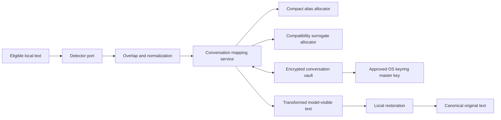

# Reversible Privacy and Conversation State Core - Plan

## Goal Capsule

- **Objective:** Build the provider-independent privacy core that detects supported PII and secrets locally, assigns stable reversible substitutes, restores them only inside the local boundary, and persists conversation state safely for resume, expiry, and explicit bypass.
- **Product authority:** `docs/initiative-brief.md`, especially R9-R34, F1-F6, and AE1-AE7.
- **Delivery boundary:** RDM-002 owns text detection, mapping, encrypted state, retention, and policy-domain behavior. RDM-003 and RDM-004 will select protocol fields and connect client session identities.
- **Open blockers:** None. English/Spanish NLP model availability is an explicit startup capability and must fail closed; packaging those models for release remains an RDM-005 concern.

## Product Contract

### Summary

For one conversation, every detected normalized entity receives one stable substitute. The original value remains available only to the local restoration path and in an authenticated encrypted vault whose key lives separately in an approved OS keyring. Known processing or state failures never forward raw data. A user may explicitly persist bypass for one conversation after a warning.

### Key Decisions

- **Detection and replacement are separate.** Presidio supplies spans and entity types; Mr Hide owns overlap resolution, normalization, alias selection, surrogate allocation, reversible storage, and restoration. This avoids coupling the product contract to Presidio anonymizer operators.
- **First-seen spelling is canonical.** Values equal after entity-aware normalization reuse one mapping and restore to the first observed spelling. This preserves R15's stable normalized identity without encoding variants into aliases.
- **Aliases are conversation-scoped reserved tokens.** A candidate is accepted only when it does not occur in source text, another original, or another substitute in that conversation. Allocation is deterministic and token-cost aware through an injected scorer.
- **Compatibility surrogates are finite banks with deterministic extension.** PII receives type-valid non-sensitive values; secrets receive conspicuously non-working stand-ins. Exhaustion derives further values without reusing a prior substitute.
- **Ciphertext and key are separated.** A random installation master key is stored only in the exact approved OS keyring. Conversation files contain versioned AES-GCM envelopes with random nonces and authenticated conversation metadata.
- **Bypass is state, not fallback.** Processing exceptions return a typed blocked result. Only an already persisted conversation-scoped bypass permits raw passage, and callers must expose that state visibly.
- **Expiry is authoritative.** Thirty days after last activity, ciphertext is deleted and resume returns an expired result; it never silently recreates the old mapping identity.

### Requirements

- R2.1. Detect supported English, Spanish, and mixed-language conversational text locally through one detector interface and a Presidio implementation.
- R2.2. Include configurable Presidio recognizers plus local recognizers for API keys, bearer/auth headers, JWTs, private keys, passwords, access tokens, and credential-bearing database URLs.
- R2.3. Resolve overlapping spans deterministically, preferring higher confidence, then longer span, then configured entity priority; never partially transform an accepted span.
- R2.4. Normalize lookup identity without storing or logging a plaintext-derived hash outside the encrypted state.
- R2.5. Allocate collision-free stable compact aliases and report measured cost without claiming savings when none exist.
- R2.5a. Reject newly supplied raw text that contains an already allocated substitute in an ambiguous position; callers must distinguish intentional restoration input from new model-visible source.
- R2.6. Allocate stable realistic compatibility surrogates and non-working secret stand-ins without reuse inside a conversation.
- R2.7. Restore substitutes using longest-match semantics and reject ambiguous, unknown, corrupt, or nested mapping state.
- R2.8. Persist mappings, allocation counters, policy, bypass, creation time, and last activity in an authenticated encrypted envelope.
- R2.9. Keep the encryption key in an approved keyring, create it once under exclusive initialization, and never fall back to plaintext or a file key.
- R2.10. Save atomically, serialize concurrent updates, reject stale writes, schema mismatch, and ciphertext tampering, and leave the previous valid vault intact after a failed write.
- R2.11. Expire state after 30 days of inactivity, refresh activity only after a successful protected or explicitly bypassed operation, and make cleanup idempotent.
- R2.12. Represent protected, blocked, bypassed, missing, and expired states explicitly without including original values in diagnostics.
- R2.13. Provide policy-domain operations for conversational text and all three tool policies without embedding OpenAI or Anthropic payload knowledge.
- R2.14. Permit additional local recognizers from validated configuration while rejecting remote recognizers, executable callbacks, unsafe regexes, duplicate names, and unsupported entity types.

### Acceptance Examples

- **AE2.1 Stable compact alias:** repeated `Juan Antonio Pérez` variants normalize to one substitute; a second person receives a different substitute; restoration yields the canonical first spelling; the cost report is factual.
- **AE2.2 Collision:** source text already contains the shortest candidate, so allocation skips it and remains stable after reload.
- **AE2.3 Mixed detection:** an English/Spanish sentence containing an email, phone, person, JWT, and database credential produces non-overlapping protected spans without sending text elsewhere.
- **AE2.4 Compatibility bank:** two distinct people consume the first two unused person surrogates; a secret receives a visibly invalid stand-in; reload preserves all allocations.
- **AE2.5 Tamper and outage:** modified ciphertext, unavailable keyring, unavailable NLP model, detector exception, or failed save returns blocked and exposes no original upstream.
- **AE2.6 Resume and expiry:** resume within 30 days restores mappings and bypass state; after expiry the vault is deleted and reported expired rather than recreated under the old identity.
- **AE2.7 Explicit bypass:** accepting the warning persists bypass only for the selected conversation; other conversations remain protected.
- **AE2.8 Tool policy domain:** default mode leaves provider-bound tool content untouched but restores known aliases locally; safe mode transforms tool content; compatibility mode uses surrogates and restores before local execution.

### Success Criteria

- All accepted detected spans are absent from model-visible transformed text and recoverable from valid local state.
- No plaintext originals, deterministic plaintext fingerprints, request bodies, keys, or mapping content appear in logs, errors, filenames, or generated evidence.
- Restart, concurrent update, tamper, expiry, and bypass behaviors are deterministic and covered on Windows and Linux-compatible filesystems.
- The core remains protocol-neutral and can be consumed by both later protocol items without branching on client names.

### Scope Boundaries

In scope: detector contracts, Presidio adapter, local secret/custom recognizers, normalization, overlap resolution, aliases, compatibility surrogates, restoration, encrypted vaults, retention, bypass, policy-domain services, fixtures, and benchmarks.

Out of scope: HTTP JSON/SSE traversal, client-native resume extraction, provider token-count calls, UI prompts, release model bundling, telemetry, remote recognizers, arbitrary code confidentiality, and claims of complete detection.

## Planning Contract

### Key Technical Decisions

- KTD1. Define small typed ports for detection, token scoring, key access, clock, and vault storage so privacy logic is hermetic and protocol-neutral.
- KTD2. Use `presidio-analyzer` with explicitly configured English and Spanish spaCy models. Validate both at startup; absence is a blocked capability, never a reduced silent mode.
- KTD3. Add local pattern/context recognizers for technical secrets and load user YAML recognizers through a constrained schema containing patterns, context, score, language, and entity only.
- KTD4. Resolve spans before replacement, then replace from right to left. Restoration uses an escaped alternation ordered by substitute length and verifies the reverse map is one-to-one.
- KTD5. Use NFKC plus case folding for person, location, organization, email domain, and configured text identifiers; preserve case-sensitive normalization for secrets and credential material.
- KTD6. Use an alias allocator with deterministic candidate banks per entity family and an injected multi-scorer. RDM-002 ships a tiktoken scorer and deterministic byte/character fallback; later client integrations may add measured provider scoring.
- KTD7. Store one JSON plaintext document only in memory, encrypt it with AES-256-GCM using a fresh 96-bit nonce, and authenticate schema version plus conversation ID as AAD.
- KTD8. Store one random master key in the approved OS keyring under a versioned service/account. Derive a per-conversation key with HKDF-SHA256 using the conversation UUID and schema version, limiting cross-vault key reuse.
- KTD9. Accept only canonical UUID conversation identifiers before deriving keys or paths. Write ciphertext through a same-directory temporary file, flush and fsync, then atomically replace. Guard each conversation with an in-process lock and an exclusive lock file for cross-process writers.
- KTD10. Use timezone-aware UTC timestamps supplied by an injected clock. Cleanup first identifies expired candidates, then acquires their lock, reloads, and deletes only if still expired.
- KTD11. Return discriminated results/exceptions with safe reason codes. Exception strings never include source text, substitute values, serialized state, file contents, or keyring errors.
- KTD12. Keep policy routing in a domain enum and direction/content-kind matrix. Protocol adapters will supply text segments and apply returned transformations without teaching the core their wire format.

### High-Level Technical Design

### Output Structure

- `src/mr_hide/privacy/`: detector ports, Presidio adapter, recognizers, spans, normalization, allocators, transformation and restoration.
- `src/mr_hide/state/`: models, key manager, encrypted codec, atomic store, repository, retention, bypass, and conversation service.
- `src/mr_hide/policy.py`: protocol-neutral policy/direction/content-kind decisions.
- `src/mr_hide/config/recognizers.py`: constrained local recognizer parsing and validation.
- `src/mr_hide/data/`: versioned alias/surrogate banks and built-in recognizer definitions shipped in the wheel.
- `tests/privacy/`, `tests/state/`, `tests/security/`: unit, property-style, integration, corruption, concurrency, and leakage tests.
- `scripts/bench_aliases.py`: deterministic cost/collision benchmark with synthetic fixtures only.

### Dependencies and Packaging

- Add bounded direct dependencies for `presidio-analyzer`, `spacy`, `cryptography`, `tiktoken`, `regex`, and a cross-platform file-lock library; regenerate and audit `uv.lock`.
- NLP model wheels are explicit runtime capabilities. Development/CI installs pinned English and Spanish models; missing or mismatched models fail `doctor` and protected startup.
- No Presidio service, Docker daemon, remote NLP API, or runtime model auto-download is allowed.

### Sequencing

1. U1 establishes domain types, detection, recognizers, overlap, and normalization.
2. U2 adds alias/surrogate allocation, transformation, restoration, and scoring.
3. U3 adds key management, authenticated encryption, atomic persistence, and concurrency.
4. U4 composes conversation lifecycle, retention, bypass, and tool-policy domain behavior.
5. U5 closes packaging, leak scans, benchmarks, docs, and cross-platform evidence.

### Risks and Mitigations

- **Model size/availability:** pin and validate models; never download implicitly or claim reduced support.
- **Regex denial of service:** constrain custom pattern length/count and reject constructs outside the accepted subset before compiling.
- **Mapping ambiguity:** enforce one-to-one substitutes, collision checks against source and originals, and corruption validation on load.
- **Nonce/key misuse:** generate nonces cryptographically, derive per-conversation keys, bind AAD, and test tampering/wrong identity.
- **Crash consistency:** atomic replace plus fsync; inject failures at each boundary and prove the previous vault remains decryptable.
- **Concurrent lost updates:** file locking plus revision numbers; stale writers reload or fail rather than overwrite.
- **Detection limitations:** document best effort, expose enabled recognizers/models, and use multilingual synthetic regression corpora.

### Sources and Research

- Microsoft Presidio installation and supported Python/NLP engines: https://microsoft.github.io/presidio/installation/
- Microsoft Presidio English/Spanish NLP configuration: https://microsoft.github.io/presidio/tutorial/05_languages/
- Microsoft Presidio supported/custom entities: https://microsoft.github.io/presidio/supported_entities/
- Cryptography authenticated encryption API: https://cryptography.io/en/stable/hazmat/primitives/aead/
- OpenAI tiktoken model/encoding API: https://github.com/openai/tiktoken/blob/main/README.md

## Implementation Units

### U1. Local multilingual detection boundary

- Add typed detected-span and detector contracts, Presidio engine construction, exact model capability checks, built-in secret recognizers, constrained custom recognizers, overlap resolution, and entity-aware normalization.
- Tests: English, Spanish, mixed language, secrets, overlaps, unsupported/missing models, custom-config rejection, no source text in errors.
- Depends on: RDM-001 only.

### U2. Reversible substitution and compatibility allocation

- Add stable mapping indexes, compact candidate scoring, collision avoidance, compatibility banks, deterministic extension, right-to-left replacement, longest-first restoration, and truthful token reports.
- Tests: repetition, normalized equality, multiple same-type entities, collisions, bank exhaustion, Unicode, unknown aliases, nested aliases, property-style round trips.
- Depends on: U1 domain types.

### U3. Encrypted resumable vault

- Add approved-keyring master key lifecycle, HKDF per-conversation keys, AES-GCM envelope, schema/AAD validation, atomic storage, revisions, file locks, and safe repository errors.
- Tests: create/reload, wrong key/ID, nonce uniqueness, tamper, truncated files, stale writers, injected write failures, keyring outage, ciphertext leak scan.
- Depends on: U2 mapping state.

### U4. Conversation lifecycle and policy domain

- Add protected/bypassed/blocked/expired states, activity refresh, retention cleanup, explicit bypass acceptance, and the default/safe/compatibility direction matrix.
- Tests: resume, expiry boundary, concurrent cleanup, bypass isolation/persistence/visibility, failure-before-forward contract, all tool-policy directions.
- Depends on: U1-U3.

### U5. Capability, packaging, and evidence closure

- Extend `doctor`, package data, CI model setup, Windows/Linux vault tests, dependency audit, synthetic benchmark, operator docs, and generated evidence.
- Tests: clean wheel, model/keyring diagnostics, deterministic docs/benchmark, sentinel scan, full Python 3.11/3.13 suite.
- Depends on: U1-U4.

## Verification Contract

- Hermetic tests use fake detector, scorer, clock, keyring, and storage ports; they run on every Python/OS quality cell.
- Presidio integration tests use pinned local English/Spanish models and never call a network service.
- System vault tests use the approved Windows Credential Locker and isolated Linux Secret Service setup already established by RDM-001.
- Security tests inspect artifacts and errors for original-value sentinels, verify tamper/wrong-key failures, and prove known failures return before any forwarding seam is invoked.
- Compatibility property tests generate Unicode strings, collisions, repeated entities, overlapping spans, and corrupted mapping documents with deterministic seeds.
- Build verification installs the wheel cleanly and confirms packaged banks/config plus no plaintext fixture evidence.

## Definition of Done

- U1-U5 and their consumer tests pass on Python 3.11 and 3.13.
- English and Spanish Presidio capability is explicit and fail-closed; custom recognizers are local and constrained.
- Compact aliases and compatibility surrogates are stable, collision-free, reversible, and truthfully measured.
- Conversation mappings and bypass survive restart only through authenticated encrypted state with key separation.
- Tamper, missing key/model, write failure, stale update, restoration failure, and expiry never produce raw fallback.
- All three tool policies are represented by protocol-neutral tested domain behavior.
- Ruff, strict mypy, dependency audit, build, clean-wheel smoke, docs drift, leak scans, code review, and security review pass.
- Review units are committed, rebased onto local `develop`, and merged locally with `--no-ff`; no push, PR, Jira, or remote merge occurs.
