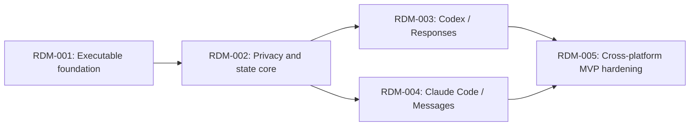

# Token-Aware Privacy Proxy Roadmap

## Context Sufficiency Summary

- `docs/initiative-brief.md` closes the former product-context gaps: it defines the MVP actors, protocols, privacy and failure behavior, tool policies, conversation lifecycle, platform/runtime constraints, success criteria, and exclusions.
- The project is intentionally greenfield. Its first roadmap item owns the unresolved implementation evidence (client resume hooks, packaging, local key protection, field matrices, and CI scaffold) before later items depend on it.
- The roadmap can therefore sequence bounded outcomes without inventing product behavior. Exact libraries, module paths, commands, and schemas remain decisions for the item-specific brainstorm and reviewed plan gates.

## Source Inventory

| Source | Contribution | Confidence |
|---|---|---|
| `docs/initiative-brief.md` | Current product authority for requirements R1-R38, flows F1-F6, acceptance examples, MVP boundaries, deferred scope, and planning questions. | High |
| `docs/orchestration/2026-07-22-001-token-aware-privacy-proxy-readiness-report.md` | Records the original readiness gaps and explains why the initiative needed a consolidated brief before sequencing delivery. | Medium |
| Repository and Git inspection on 2026-07-22 | Confirms a greenfield repository on `master`, with no implementation, build/test configuration, CI, or established feature-branch convention yet. | High |

## Roadmap Items

- RDM-001. **Establish the executable privacy-proxy foundation**
  - Outcome: Contributors have a runnable Python 3.11+ project skeleton and verified technical contracts for local proxy boundaries, client launch/resume integration, packaging, encrypted local state, and cross-platform verification.
  - Why now: Every runtime capability depends on decisions explicitly deferred to planning, and the current repository has no executable system shape or verification commands.
  - Scope boundary: Includes architecture and compatibility evidence, project/package scaffold, configuration boundaries, safe diagnostic conventions, fixture strategy, and baseline Windows/Linux CI. Excludes production privacy transformation, complete protocol forwarding, and distributable MVP claims.
  - Hard depends on: None.
  - Soft sequencing preference: None.
  - Blocks/enables: RDM-002, RDM-003, RDM-004, RDM-005.
  - Risk: High — supported client resume identity and OS-specific key protection must be proven without weakening the product contract.
  - Expected brainstorm: `docs/brainstorms/rdm-001-executable-privacy-proxy-foundation.md`
  - Expected plan: `docs/plans/rdm-001-executable-privacy-proxy-foundation.md`
  - Suggested package: Split only where a discovery/contract slice and the resulting scaffold are independently verifiable; otherwise keep one roadmap-item package with focused review units.

- RDM-002. **Build the reversible privacy and conversation-state core**
  - Outcome: Detected PII and secrets can be transformed and restored consistently inside one conversation, with compact aliases, compatibility surrogates, encrypted resumable state, retention, explicit bypass state, and fail-closed behavior.
  - Why now: This is the provider-independent privacy boundary on which both supported protocols and all three tool policies rely.
  - Scope boundary: Includes local Presidio integration, supported recognizers, normalization and collision rules, alias measurement, surrogate banks, vault lifecycle, redaction-safe diagnostics, and policy-domain behavior. Excludes HTTP protocol adapters and client launch UX except for test seams.
  - Hard depends on: RDM-001.
  - Soft sequencing preference: None.
  - Blocks/enables: RDM-003, RDM-004, RDM-005.
  - Risk: High — errors in mapping, key separation, restoration, logging, or expiry can disclose or destroy sensitive state.
  - Expected brainstorm: `docs/brainstorms/rdm-002-reversible-privacy-conversation-core.md`
  - Expected plan: `docs/plans/rdm-002-reversible-privacy-conversation-core.md`
  - Suggested package: Prefer capability slices for detection/substitution, durable vault lifecycle, and tool-policy mapping only when each slice is independently testable and mergeable.

- RDM-003. **Protect Codex over OpenAI Responses**
  - Outcome: A user can launch and resume Codex through Mr Hide against an arbitrary Responses-compatible upstream while supported text, SSE, counting, tools, errors, and unknown fields retain their protocol behavior and selected privacy policy.
  - Why now: Codex is one of the two named MVP clients and supplies an end-to-end proving surface for the shared privacy core.
  - Scope boundary: Includes the OpenAI Responses route/field matrix, transparent forwarding, streaming transformation/restoration, Codex-specific launch and resume binding, and all three tool modes. Excludes Anthropic translation, model routing, and unsupported OpenAI API parity.
  - Hard depends on: RDM-001, RDM-002.
  - Soft sequencing preference: None; may proceed in the same wave as RDM-004 after shared contracts stabilize.
  - Blocks/enables: RDM-005.
  - Risk: High — streaming boundaries, tool history, and client resume identifiers can break restoration or protocol preservation.
  - Expected brainstorm: `docs/brainstorms/rdm-003-codex-openai-responses.md`
  - Expected plan: `docs/plans/rdm-003-codex-openai-responses.md`
  - Suggested package: One independently demonstrable Codex capability slice, with separate review units only for boundaries that have their own fixtures and verification.

- RDM-004. **Protect Claude Code over Anthropic Messages**
  - Outcome: A user can launch and resume Claude Code through Mr Hide against an arbitrary Messages-compatible upstream while supported text, SSE, token counting, tools, errors, and unknown fields retain their protocol behavior and selected privacy policy.
  - Why now: Claude Code completes the MVP's second native client without turning Mr Hide into a protocol translator.
  - Scope boundary: Includes the Anthropic Messages route/field matrix, transparent forwarding, streaming transformation/restoration, Claude-specific launch and resume binding, and all three tool modes. Excludes OpenAI translation, model routing, and unsupported Anthropic API parity.
  - Hard depends on: RDM-001, RDM-002.
  - Soft sequencing preference: None; may proceed in the same wave as RDM-003 after shared contracts stabilize.
  - Blocks/enables: RDM-005.
  - Risk: High — Anthropic streaming events, tool content blocks, counting, and resume behavior require client-specific preservation evidence.
  - Expected brainstorm: `docs/brainstorms/rdm-004-claude-code-anthropic-messages.md`
  - Expected plan: `docs/plans/rdm-004-claude-code-anthropic-messages.md`
  - Suggested package: One independently demonstrable Claude Code capability slice, with separate review units only for boundaries that have their own fixtures and verification.

- RDM-005. **Harden and package the cross-platform MVP**
  - Outcome: Users can install and operate a release-candidate CLI on Windows and Linux, with documented privacy limitations and automated evidence for both clients, all tool policies, vault retention, failure/bypass behavior, composition, and configuration preservation.
  - Why now: Release usability and the brief's success criteria can only be proven after both client paths exercise the shared privacy boundary.
  - Scope boundary: Includes package/distribution hardening, end-to-end and cross-platform matrices, operational documentation, retention cleanup, compatibility and alias benchmarks, and release-readiness evidence. Excludes macOS, centralized administration, additional protocols, dashboards, and guaranteed detection claims.
  - Hard depends on: RDM-003, RDM-004.
  - Soft sequencing preference: Documentation and fixture preparation may begin earlier, but release assertions wait for both dependencies.
  - Blocks/enables: MVP release handoff.
  - Risk: Medium — the main risk is integration drift across OS, clients, protocols, and the three privacy modes rather than new product behavior.
  - Expected brainstorm: `docs/brainstorms/rdm-005-cross-platform-mvp-hardening.md`
  - Expected plan: `docs/plans/rdm-005-cross-platform-mvp-hardening.md`
  - Suggested package: Split packaging/docs from the cross-client acceptance matrix only if both remain independently reviewable and the release claim stays gated on their combination.

## Dependency Graph

## Parallelization Waves

- Wave 1: RDM-001.
- Wave 2: RDM-002.
- Wave 3: RDM-003 and RDM-004 are logically independent after shared contracts stabilize. Compound Master should still default to serial execution under `parallel:false` and `worktree-policy:avoid`.
- Wave 4: RDM-005 after both client capabilities pass their own verification gates.

## Branch and PR Strategy

The repository currently uses `master` as its observed integration base. This is evidence, not permission to ship directly to it. Exact feature branch names and PR bases must be reconfirmed by Compound Master/Release Marshal when packages are executed.

| Package candidate | Base branch | PR type | Dependency | Notes |
|---|---|---|---|---|
| RDM-001 foundation | `master` (observed; reconfirm at execution) | Review-unit or grouped work-package PR | None | Prefer the coarsest independently verifiable foundation slice; do not ship planning artifacts alone. |
| RDM-002 privacy core | Refreshed integration base containing RDM-001 | Review-unit PRs, capped at 2 open stacked PRs where dependency requires stacking | RDM-001 | Security-sensitive vault and privacy boundaries require explicit review and verification. |
| RDM-003 Codex capability | Refreshed integration base containing RDM-002 | Independently mergeable capability PR | RDM-002 | Avoid a deep micro-PR stack for route, SSE, tools, and launch behavior. |
| RDM-004 Claude capability | Refreshed integration base containing RDM-002 | Independently mergeable capability PR | RDM-002 | May be a sibling of RDM-003; no cross-protocol translation dependency. |
| RDM-005 MVP hardening | Refreshed integration base containing RDM-003 and RDM-004 | Reviewable release-readiness slice(s) | RDM-003, RDM-004 | Keep packaging/docs with the verified behavior they describe; release handoff remains Release Marshal-owned. |

## Blockers and User Decisions

- No blocker prevents the first item-specific brainstorm.
- Each brainstorm/plan must resolve its listed technical choices from evidence and may not weaken or silently expand `docs/initiative-brief.md`.
- Before implementation, confirm the integration base and branch convention; `master` is only the currently observed base.
- Jira is optional and currently configured at environment level, but no issue key or safe mutation context exists yet. Jira creation or transitions belong to the later Release Marshal handoff, not this roadmap phase.

## Review Record

- Result: passed on 2026-07-22 with no blocking, gated, or safe-auto findings.
- Coverage: coherence, feasibility, product, security, scope, and adversarial document lenses were run inline in headless mode under the repository's sequential-review instruction.
- Cross-model additive pass: not run because no external review route was explicitly sanctioned in the current context; this does not reduce the required inline review result.
- Next gate: interactive brainstorm for RDM-001 only.
